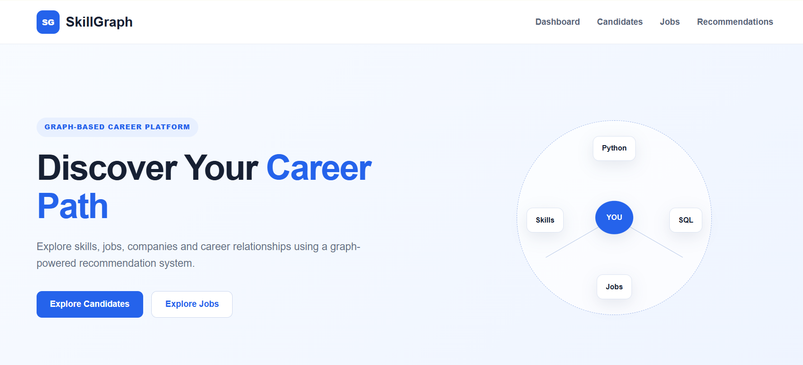
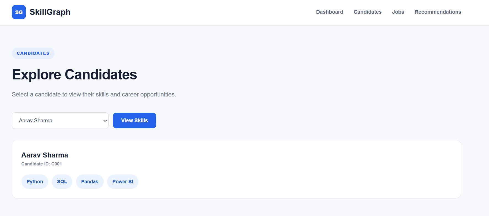
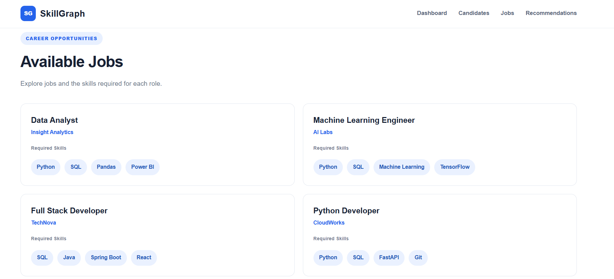
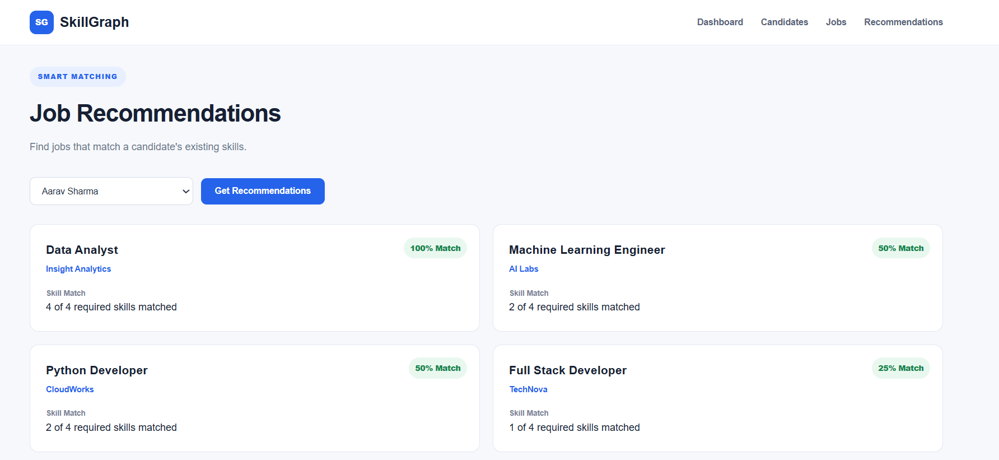
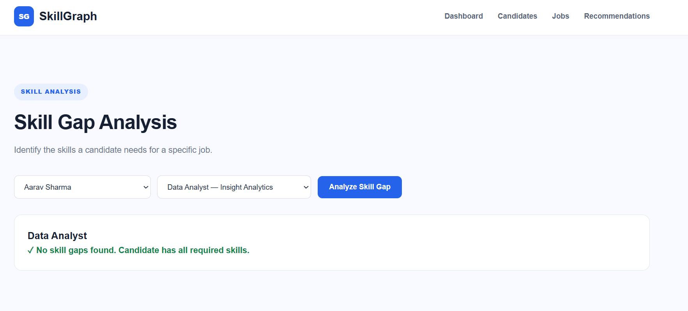
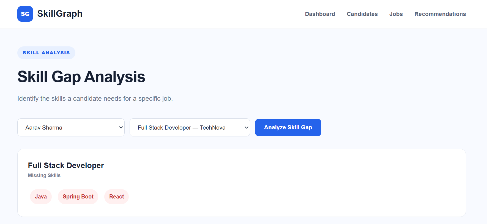
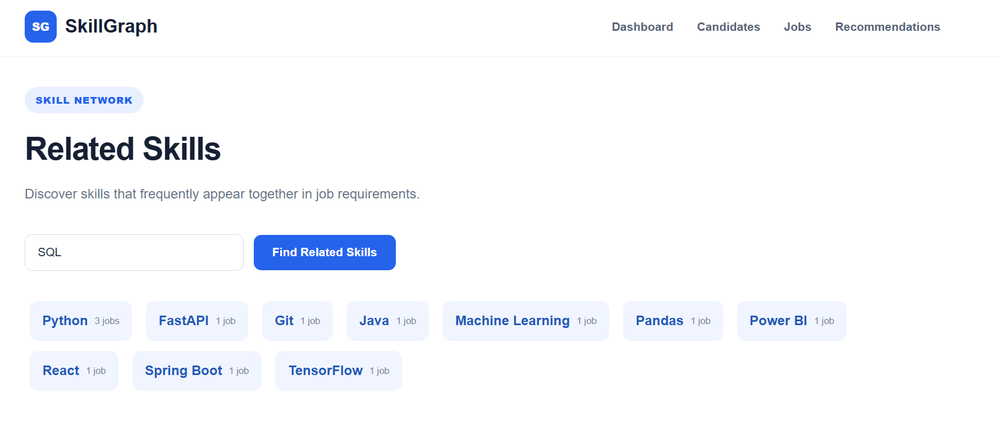
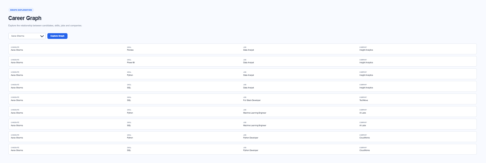

# SkillGraph

SkillGraph is a career intelligence platform that connects candidates, skills, jobs, and companies to help users identify suitable career opportunities and skill gaps.

## Features

- Candidate skill exploration
- Job and skill requirement analysis
- Smart job recommendations
- Skill gap analysis
- Related skills discovery
- Career graph visualization

## Tech Stack

- Python
- Flask
- HTML
- CSS
- JavaScript
- SQL

## Project Screenshots

### Dashboard

### Candidates

### Jobs

### Job Recommendations

### Skill Gap Analysis

### Missing Skills

### Related Skills

### Career Graph
