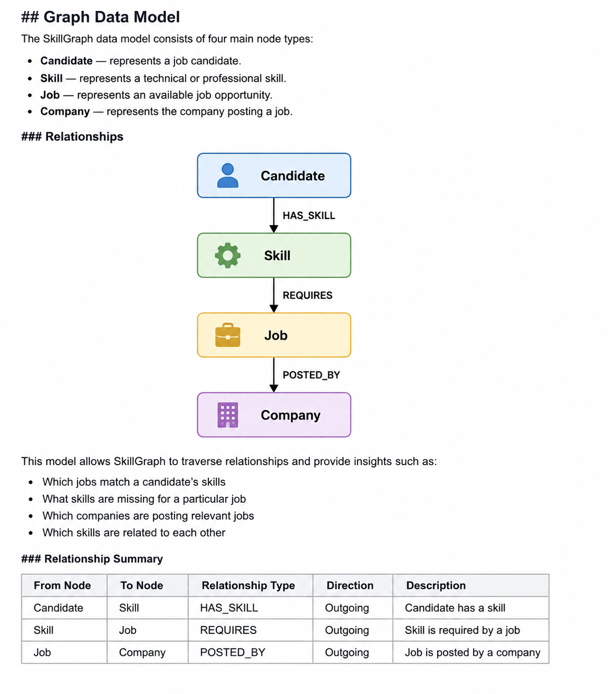

# SkillGraph

SkillGraph is a graph-based career intelligence platform that connects candidates, skills, jobs, and companies to provide personalized job recommendations and skill gap analysis.

## Features

- Candidate skill exploration
- Job and skill requirement analysis
- Smart job recommendations with match percentage
- Skill gap analysis
- Related skills discovery
- Career graph exploration
- Graph-based relationship analysis

## Tech Stack

- Python
- FastAPI
- CognoDB
- Neo4j Python Driver
- Cypher / openCypher
- HTML
- CSS
- JavaScript

## Why a Graph Database?

SkillGraph focuses on relationships between candidates, skills, jobs, and companies.

A graph database makes relationship-based queries natural, such as finding matching jobs, identifying missing skills, discovering related skills, and exploring career paths.

In a relational database, these questions would require multiple tables and complex JOIN operations. With CognoDB, these relationships are represented directly as nodes and typed relationships, making graph traversal easier to understand and extend.

## Graph Data Model

The main nodes are:

- **Candidate** — represents a job candidate.
- **Skill** — represents a technical or professional skill.
- **Job** — represents an available job opportunity.
- **Company** — represents the company posting a job.

### Graph Diagram



### Relationships

```text
Candidate ──HAS_SKILL──> Skill
Skill <──REQUIRES── Job
Job ──POSTED_BY──> Company